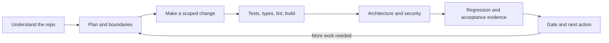

<p align="center">
  
</p>

# OpenPitStop

**OpenPitStop gives your AI coding CLI a repo-aware engineering workflow: understand, plan, check architecture, test security, and verify.**
**Use it to turn fast code generation into reviewable changes, with regression evidence, explicit boundaries, and local checks that use zero model credits.**

[](https://www.npmjs.com/package/openpitstop)
[](https://github.com/Krish-1507/OpenPitStop/actions/workflows/ci.yml)
[](LICENSE)

Working code can still be wrong for the system. A change can pass a test while bypassing
authentication, crossing a module boundary, weakening an assertion, or breaking a real user
flow. PitStop makes those questions part of a repeatable workflow, with inspectable evidence
and explicit `UNPROVEN` results when the checks cannot establish an answer.

**Local CLI · Bring your own coding agent · No PitStop account · No telemetry · MIT**

## Start with one command:

Requires **Node.js 22+** and npm. Git is needed for change comparison and isolated worktrees.

```bash
npm install -g openpitstop
pitstop ask "understand this repo"
```

Or get a quick first scan without a global install:

```bash
npx openpitstop try .
```

`try` runs the lighter checks and saves a baseline. It does not run the full test/build
stack; duration depends on the repository and installed tools.

Install the slash command into your coding CLI, then speak naturally:

```bash
pitstop install
```

```text
/pitstop find vulnerabilities in this repo
/pitstop find and fix vulnerabilities in this repo
/pitstop review my changes
```

PitStop executes the matching workflow internally. The host CLI handles the slash
command; the terminal equivalent is `pitstop ask "find vulnerabilities in this repo"`.
Static vulnerability searches need no model call and do not boot the app.

Then say what you need:

| Your request | PitStop runs internally |
|---|---|
| `pitstop ask "check the security of this app"` | Static security review; no app boot |
| `pitstop ask "check tests types lint and build"` | Discovered verification layers, with failure diagnosis |
| `pitstop ask "review my changes"` | Repo understanding → architecture → verification stack → evidence gate |
| `pitstop ask "did my agent cheat"` | Test and verification integrity checks |
| `pitstop ask "can I ship this"` | Strict gate; `UNPROVEN` returns a failure exit code |
| `pitstop ask "show my budget"` | Recorded scan/test/build activity |
| `pitstop ask "what should I do next"` | Next action and remaining work |

The router runs locally and makes **no LLM call**. It recognizes common requests; it is
not a general language model. Unknown requests and unsupported constraints run nothing.
Use `--dry-run` to preview, `--repo ./app` to select a repository, or `--json` for a
machine-readable routing preview. The executed command's exit code is preserved.

Actions that write source, launch a paid agent, install integrations, or actively attack
an app are previewed until you add `--execute`:

```bash
pitstop ask "make this safe" --dry-run
pitstop ask "make this safe" --execute
pitstop ask "attack my app" --execute
```

`make this safe` runs the supported deterministic fix workflow. It does not promise to
repair every issue. `attack my app` runs the live security checks without silently applying
fixes. Test and build checks execute your repository's scripts; use trusted repositories.

## The engineering loop



| Engineering question | Evidence PitStop provides |
|---|---|
| What system am I changing? | Languages, frameworks, entry points, module map, verification commands, CI and CODEOWNERS |
| What may this change touch? | A sealed plan, declared import boundaries, protected/forbidden paths and scope checks |
| Why did verification fail? | Per-layer results and diagnoses: assertion, type error, missing dependency, lint, environment or timeout |
| Does the change fit this repo? | Declared architecture rules, ownership routing and suspicious shortcuts in the diff |
| Did the fix address the actual bug? | The same verification against a known-bad baseline and the candidate |
| Did it meet the requirement? | An acceptance contract with command, HTTP and file criteria |
| Did it break existing behavior? | Check-level baseline/candidate comparison and optional repeated runs |
| Why trust the verdict? | Inspectable artifacts, content digests, evidence references and explicit missing checks |

Repo awareness is structural analysis and declared rules. Semantic design judgment still
belongs to the developer and host agent. A plan or gate checks behavior within its scope;
it does not prevent a separately running agent from editing files.

<p align="center">
  
</p>

## Feature tour

### Understand, plan and protect the architecture

`understand` discovers the repository's structure and tools. `plan` records the goal,
steps, expected paths and verification commands before source patching.
`architecture-check --against-plan` checks scope, declared import boundaries, protected
paths, forbidden paths, CODEOWNERS routing and shortcuts in the diff.

Configure boundaries in `openpitstop.architecture.json` or `.pitstop/architecture.json`.
Protected-path approval is recorded through an explicit option; it is not an authenticated
human identity. [Configuration and examples](docs/repo-discipline.md).

### Scan and score

`scan` combines dependency graphs, security, duplication, tests, performance, accessibility,
reliability and developer-experience checks. Findings include locations and fix guidance;
related findings are grouped. Optional missing tools are reported as skipped.

The **0–100 score** summarizes the categories that ran. It is not a probability of
correctness or security: always read the coverage and skipped categories alongside it.

<p align="center">
  
</p>

### Test pyramid and failure diagnosis

`test` discovers unit, integration and E2E layers separately and reports failing test names
when the runner exposes them. `verify-stack` adds typecheck, lint and build with targeted
failure diagnosis. Missing layers are visible, not fabricated passes. A failing layer
returns a nonzero exit. [Verification stack](docs/repo-discipline.md).

### Security testing and fixes

`pen --static` reviews supported patterns without booting the app. `pen` also starts the
local application and sends supported attack probes, recording requests, responses and
intercepted outbound activity. Findings distinguish static indications from runtime evidence.
The [security matrix](docs/security.md) describes the built-in checks; optional Semgrep
adds a separate SAST engine.

`pen --fix` writes repro tests for supported findings and patch files for a small set of
deterministic fixes, including Express header hardening. It does not apply source patches.
`fix` runs understand → scan → generate → plan → apply → recheck security → stack and gate.
Automatic source patching requires a clean git tree, creates a `pitstop/fix-*` branch,
respects protected paths and the plan, and never commits or pushes. `--no-apply` keeps
source patches for review but still writes repro tests and reports. Unsupported fixes
remain explicit work for you or your agent.

**Execution boundary:** live pen, payment attacks and their generated repros run in a
disposable Linux Docker container: no external network, read-only root and input mounts,
non-root user, no capabilities, and bounded CPU/memory/processes/time. Only a sanitized
copy is exposed; `.git`, `.env*`, common credential files and host environment secrets
are excluded. There is no automatic host-execution fallback.

Install/start Docker once, then prepare the default Node image:

```bash
docker pull node:22-bookworm-slim
pitstop ask "attack my app" --execute
```

Missing Docker, missing dependencies or an unbootable app produces an aborted check,
never a clean security verdict. Non-Node/native dependencies need a prepared Linux image
selected with `PITSTOP_SANDBOX_IMAGE`; use a trusted image with Node and your runtime.
Dependencies must already work on Linux; the isolated run cannot download them.
See [execution and spending controls](docs/release-controls.md).

<p align="center">
  
</p>

### Verification beyond a green suite

| Layer | What it checks | Guide |
|---|---|---|
| `baseline-verify` | Verification fails on a known-bad commit and passes on the candidate; verification identity stays consistent. An intended-failure predicate distinguishes the bug from environment failure. | [Baseline](docs/baseline-verify.md) |
| `state-verify` | Structured file-change claims against actual filesystem and git state | [State](docs/state-verify.md) |
| `verifier-check` | A known-good case passes and an explicit known-bad case fails | [Falsifiability](docs/verifier-check.md) |
| `holdout-verify` | An externally maintained suite checks the committed candidate with redacted results | [Holdout](docs/holdout-verify.md) |
| `acceptance-verify` | Observable requirements defined in a pinned contract | [Acceptance](docs/acceptance-verify.md) |
| `regression-check` | Previously passing checks versus the candidate; new, missing and flaky checks remain distinguishable | [Regression](docs/regression-check.md) |
| `integrity` | Deleted/focused/weakened tests, hardcoded passes, suppression creep and other suspicious diff patterns | [Real examples](docs/caught-in-the-wild.md) |

These layers need meaningful contracts, baselines or suites. `flow` runs configured
stages and reports others as skipped. Git worktrees isolate checkouts, not process
permissions. A holdout is hidden only when the host's filesystem permissions actually
keep it outside the editing agent's reach.

### Gate and evidence chain

`gate` combines live measurements and saved verification layers. Its decision order is
`CHEAT → BLOCKED → FAILED → UNPROVEN → VERIFIED`. `explain` shows the evidence chain;
`honesty` exposes limitations and supporting measurements.

```bash
pitstop gate --strict --require stack,architecture,acceptance,regression
```

In strict mode only `VERIFIED` exits `0`; insufficient or failed evidence exits `1`,
and detected integrity manipulation exits `2`. Legacy `gate` without `--strict` can
exit `0` with `UNPROVEN` for compatibility. Required layers never silently disappear.
Other commands have their own exit contracts; inspect `--help` and the linked guides.

Artifacts use canonical SHA-256 content digests. They detect edits that do not update
the digest; they are **not cryptographic signatures from a trusted external signer**.
Someone with write access can recompute them. Keep authoritative verification and
holdouts in trusted CI or a separate permission boundary. Every passing historical gate
layer must match the current source snapshot, Git state, policy and PitStop engine.
Missing/old bindings or changed inputs become `UNPROVEN`; commit-based checks also
require that exact clean candidate. Contract and holdout changes invalidate their results.
[Evidence semantics](docs/explain.md).

### Payment proofs, drift and repros

`scan --ledger` replays duplicate webhooks, concurrent submissions and delayed retries
through a mock payment gateway. Duplicate charge receipts provide evidence for the
tested scenario. Proxy-only stacks have weaker observation coverage, while Docker still enforces the
network boundary. This does not prove all payment behavior.

`pen` compares comparable runs to identify new, disappeared and escalated findings.
A disappeared finding is a signal to investigate; preserve and replay the regression
test to establish that the fix holds. `repro <id>` generates and runs supported repros;
unsupported findings need a developer-written check. [Demo](docs/demo.md).

### Keep the loop affordable

- **No model required** for intent routing, structural discovery, built-in scans and
  verification. Your chosen agent uses its own provider credits when it reasons or edits.
- **Content-aware reuse:** `scan --reuse` checks the baseline digest, file contents and
  paths, git HEAD, scan options and selected engine/environment settings. Deleted files,
  backdated edits and dot-directory changes invalidate reuse. Quick scans cannot replace
  full scans. Snapshots are checked before and after measurement.
- **Bounded freshness:** cached scans expire after one hour; live ledger checks are not
  reused. Symlinks, unreadable inputs and snapshot size limits force a fresh scan.
  Generated/dependency directories are excluded. Reuse is an iteration optimization,
  not release evidence: run fresh checks after changing installed tools, dependencies,
  services or environment variables outside the recorded inputs.
- **One shared agent budget:** `drive` defaults to three total launches, ten minutes
  and 48,000 total prompt characters across every finding. Change these with
  `--max-agent-calls`, `--max-seconds` and `--max-prompt-chars`. Repeated identical
  failures stop retries; concurrent/nested drive sessions are refused.
- **Optional dollar ceiling:** `drive --max-cost-usd 1` divides one allowance across
  all launches using Claude print mode’s native budget flag. Providers without an
  enforceable adapter refuse this request before an agent starts.
- **Honest accounting:** `budget` reports recorded test/build time and activity counts.
  It cannot read your agent's token bill, prove cache savings or promise a dollar amount.

`memory` keeps decisions and rejected approaches; `ready-check` explains reuse eligibility;
`doctor` explains missing tools. `watch` rescans during editing, while `trends` and `digest`
show the repository's recorded progress.

## Install into your coding CLI

```bash
pitstop install
```

The installer writes agent instruction files. Check its displayed destinations; use
`--force`/`-y` deliberately when replacing existing files. `pitstop prompt` prints the
full workflow for inspection or manual installation. In a host that supports the
installed command, use `/pitstop` or `/pitstop check the security of this app`.

| Bundled target | Command location |
|---|---|
| Claude Code | `.claude/commands/pitstop.md`, plus a skill template |
| OpenCode | `.opencode/commands/pitstop.md` and configured user locations |
| Kilo | `.kilo/commands/pitstop.md` and legacy workflow locations |
| Antigravity | `.agent/workflows/pitstop.md` and legacy workflow locations |
| Gemini CLI | `.gemini/commands/pitstop.toml` |
| Codex CLI | `~/.codex/prompts/pitstop.md` |
| Cursor command files | `.cursor/commands/pitstop.md` |
| Other agent CLIs | Export `pitstop prompt` into their supported custom-command format |

Portable instructions can be used with FreeBuff, Grok Build, MUSE Code and other CLIs
that accept them; those integrations are not automatically validated by the presence of
a Markdown file. Host versions determine command invocation and argument syntax.
The shipped installer does not provide a dedicated Codex desktop-app or Codex VS Code
extension integration. [Installer targets](src/installer/targets.ts).

## Every command, by job

| Job | Commands |
|---|---|
| Start and navigate | `ask`, `next`, `try`, `demo`, bare `pitstop` onboarding |
| Understand and plan | `understand`, `plan`, `architecture-check`, `memory` |
| Measure and diagnose | `scan`, `test`, `verify-stack`, `doctor`, `ready-check` |
| Fix and inspect | `inspect`, `repro`, `drive`, `fix` |
| Security | `pen`, `pen --static`, `pen --fix`, `scan --ledger` |
| Verify | `verify`, `flow`, `gate`, `integrity`, `baseline-verify`, `state-verify`, `verifier-check`, `holdout-verify`, `acceptance-verify`, `regression-check` |
| Explain and share | `explain`, `honesty`, `report`, `share`, `trends`, `digest`, `budget` |
| Integrate | `install`, `prompt`, `watch`, `ci` |

Use `pitstop <command> --help` for exact options. `report --html` produces a self-contained
HTML report and a README badge; `share` creates a screenshot-ready card. `ci` produces
PR-ready reports, and `install --hooks` installs a pre-commit gate. See the
[GitHub Action guide](docs/github-action.md) and [repository workflow guide](docs/repo-discipline.md).

## Where OpenPitStop fits

OpenPitStop's focus is the engineering workflow around a change. Specialized tools
remain useful alongside it; the project does not claim universal detection superiority.

| Tool | Documented focus | Relationship to OpenPitStop |
|---|---|---|
| [Strix](https://github.com/usestrix/strix) | Agentic security investigation, exploit validation and remediation; also documents CI and continuous testing | A deeper security-testing option. PitStop concentrates on local checks, architecture rules, regression contracts and evidence gates across the change lifecycle. |
| [Semgrep](https://docs.semgrep.dev/getting-started/quickstart) | Rule-based static security analysis and broader security products | Optional SAST integration already exists through `PITSTOP_SEMGREP_CONFIG`. |
| [CodeQL](https://docs.github.com/en/code-security/concepts/code-scanning/codeql/codeql-code-scanning) | Queries over a code database for security analysis | Complementary analysis; no built-in CodeQL execution integration is claimed. |
| [ZAP](https://www.zaproxy.org/docs/automate/automation-framework/) | Web security automation, authenticated contexts and active/passive scanning | Broader web-testing infrastructure; a future adapter would complement the built-in probes. |
| [Aider](https://aider.chat/docs/repomap.html) | AI coding with repository maps and relevant context | A host editing agent; PitStop adds independently executed checks around its changes. |

Research checked **2026-09-25** against the linked primary sources. This is a capability
comparison, not a benchmark. [Detailed audit, research and next milestones](docs/engineering-review.md).

## Architecture and limits

The TypeScript CLI dispatches commands to analyzers, repository-understanding modules,
security probes and verification engines. Results live in `.pitstop/`; the report and
gate layers consume them. Templates instruct the host coding agent, and `drive` can invoke
that agent. `fix` is the separate, limited deterministic patch path.

The strongest built-in coverage is JS/TS and Node application workflows. Native test
runners and optional tools extend other stacks, but support varies by feature. Architecture
checks rely on declared rules and supported import patterns; they do not infer a complete
system design. Static findings can be false positives, and live probes can miss vulnerabilities.
Acceptance contracts and tests are only as strong as the behavior they assert.

Linux and Windows are included in CI. Passing these fixtures does not establish correctness
for every repository, framework or environment. No tool can promise to remove all engineering
problems or make every application secure.

## Privacy

OpenPitStop has no telemetry service or hosted account requirement. Dependency audits,
opt-in external tools, repository scripts and a host coding agent may access the network.
Reports can contain code locations and security evidence; review them before sharing.
See [PRIVACY.md](PRIVACY.md) for the connection and storage details.

## Contribute

The most useful contributions are reproducible bugs, meaningful verification fixtures,
framework adapters and measured false-positive reductions. Start with
[CONTRIBUTING.md](CONTRIBUTING.md) and the [engineering roadmap](docs/engineering-review.md).

If PitStop catches a real failure, share the minimal reproduction and its evidence.
[Star the project](https://github.com/Krish-1507/OpenPitStop) or
[open an issue](https://github.com/Krish-1507/OpenPitStop/issues).

[MIT License](LICENSE) · Built by **Krish J**
