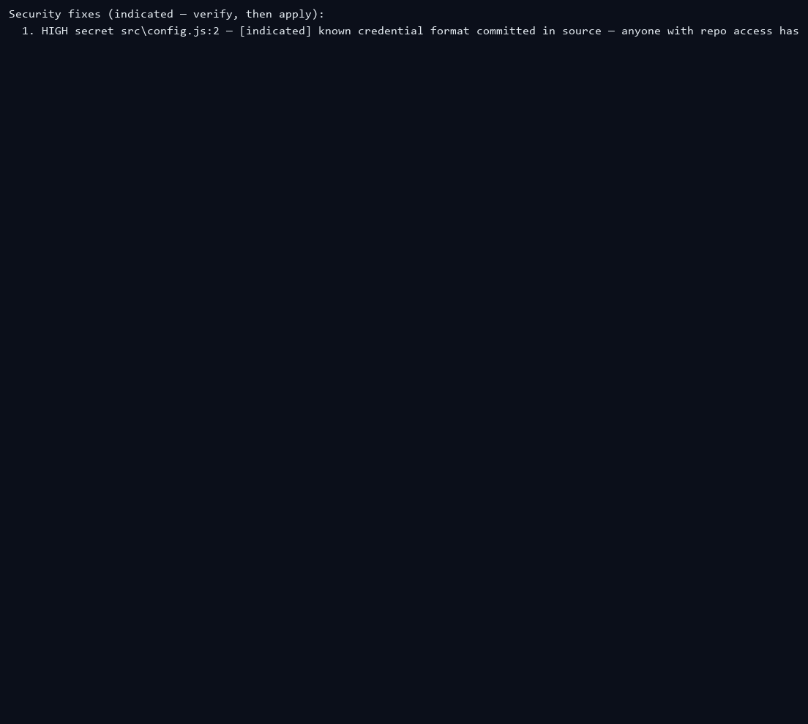

<p align="center">
  
</p>

# OpenPitStop CLI

**The agent finally has a referee it can't cheat.** OpenPitStop is a CLI that scans your repo,
scores it, and checks everything your AI coding agent does — so when it says "done", you
know it's actually done.

[](https://www.npmjs.com/package/openpitstop)
[](https://github.com/Krish-1507/OpenPitStop/actions/workflows/ci.yml)
[](LICENSE)

> AI coding agents are brilliant at fixing things — and equally brilliant at *saying they
> did* when they didn't. OpenPitStop measures your repo with scans, seals every number so it
> can't be edited later, attacks your app with a live penetration test, and checks every
> change your agent makes. The exit codes tell you the truth: `0` clean · `1` suspicious ·
> `2` confirmed cheat.

---

## Why I built this

I spend my days running coding agents on real repos. They're brilliant at fixing things —
and equally brilliant at *telling me they did* when they didn't: focusing tests to hide
failures, deleting the failing test, editing an assertion to match the buggy output. I got
tired of auditing my agent's work by hand, so I built a referee.

OpenPitStop is my own workflow tool, not a showcase: every repo I touch gets the loop, every
change gets the gate, and the numbers in this README are the same numbers I trust. It's
dogfooded hard — OpenPitStop's own CI scans a real repo with OpenPitStop on every push (Linux and
Windows), and the evidence chain is regression-tested because a bug in it once made OpenPitStop
cry `TAMPERED` at baselines it had just written. If it can referee itself, it can referee
your agent.

---

## Quick Nav

| Jump to | |
|---|---|
| [Feature tour](#feature-tour) — the 13 demos | [Install](#install) · [Usage](#usage) · [Tool support](#tool-support) |
| [See it in 90 seconds](#see-it-in-90-seconds) | [What OpenPitStop actually does](#what-openpitstop-actually-does) · [Every command](#every-command) |
| [Architecture](#architecture) | [Known limitations](#known-limitations) · [Contributing](#contributing) · [License](#license) |

**Straight to one feature:** [The scan](#the-scan) · [Security fixes](#security-fixes) · [Try it on your repo](#try-it-on-your-repo) · [The test pyramid](#the-test-pyramid) · [The gate](#the-gate) · [Integrity](#integrity) · [The pen test](#the-pen-test) · [Honesty](#honesty) · [Verify](#verify) · [Trends](#trends) · [Inspect](#inspect) · [Repro](#repro) · [Report](#report) · [Share](#share) · [The live shield](#the-live-shield) · [The GitHub Action](#the-github-action) · [The pre-commit hook](#the-pre-commit-hook)

**Receipts:** [Caught in the wild](docs/caught-in-the-wild.md) — real gate output, screenshot-ready.

---

## Feature tour

Every clip below is real opencode output, captured from a live agent session —
the only thing trimmed is dead time.

### The scan

`pitstop scan` — every check runs at once, one box, one score.

<p align="center">
  
</p>

### Security fixes

`pitstop scan` — and below the box, the indicated fixes, with a concrete
`fix:` line for each finding.

<p align="center">
  
</p>

### Try it on your repo

`pitstop try .` — score any repo in ~2 seconds of scanning, no setup, no config.
(First `npx openpitstop …` on a machine downloads the package once — a few seconds;
`npm i -g openpitstop` makes even that instant.)

<p align="center">
  
</p>

### The test pyramid

`pitstop test` — unit, integration and e2e layers run separately, so a
suite that "passes" can't hide a missing layer. One failing layer means
**DO NOT SHIP**.

<p align="center">
  
</p>

### The gate

`pitstop gate` — the score plus the integrity check, exit 0/1/2:
clean / suspicious / confirmed cheat.

<p align="center">
  
</p>

### Integrity

`pitstop integrity` — diff against the sealed baseline, hunting cheat
patterns: focused tests, deleted tests, rewritten tests.

<p align="center">
  
</p>

### The pen test

`pitstop pen` — boots your app in a sandbox, attacks it, and writes PROVEN
verdicts — plus repro tests and a patch with `--fix`.

<p align="center">
  
</p>

### Honesty

`pitstop honesty` — an honest assessment of what this tool can't do.

<p align="center">
  
</p>

### Verify

`pitstop verify` — re-scan after a change and see exactly how the score moved. Also checks your diff for cheat patterns.

### Trends

`pitstop trends` — per-category sparklines from your scan history.

### Inspect

`pitstop inspect <finding-id>` — open up one finding: the code snippet, the root cause, whether a repro test exists, and what OpenPitStop remembers about these files.

### Repro

`pitstop repro <finding-id>` — every fix starts with a failing test. The test is written to fail *now* and pass after the fix.

### Report

`pitstop report --html` — one self-contained HTML report, sealed with an evidence signature.

### Share

`pitstop share` — one-card summary, easy to paste into a PR or a demo chat.

### The live shield

`pitstop watch` — re-scans the moment a file changes and prints the score delta.

### The GitHub Action

`uses: openpitstop/action` (or `Krish-1507/OpenPitStop@main` today) — every PR
gets the gate as a comment and a failing check when it matters. No wiring by
hand; the badge in your README regenerates itself. [Setup & badge loop →
](docs/github-action.md)

### The pre-commit hook

`npx openpitstop install --hooks` — the gate one step earlier: the commit
can't land until the gate passes. Caught it before it shipped. [Real blocked
commits → ](docs/caught-in-the-wild.md#bonus-the-same-catches-as-a-pre-commit-hook)

---

## See it in 90 seconds

Two commands. First, a real broken repo — scanned, scored and reported in seconds:

```bash
npx openpitstop@latest demo
```

Then the part that gets the *wow*: a scripted arc where a lazy agent tries to make the
failing suite green without fixing the bug — and the gate catches both attempts:

```bash
node scripts/cheat-demo.cjs                             # from a OpenPitStop repo checkout
node node_modules/openpitstop/scripts/cheat-demo.cjs   # from any project that installed it
```

Set `PITSTOP_CLI="node /path/to/dist/cli.js"` to run it against a local build instead
of the registry. For a tight re-record, `node scripts/cheat-demo.cjs --fast --no-pitch`
reuses the cached `node_modules` (skips `npm install`) and ends the arc on the
CONFIRMED_CHEAT box — no pitch, no dead air.

```
ACT 1  honest baseline              →  1 failed test, scanned and sealed
ACT 2  agent focuses passing tests  →  GATE: SUSPICIOUS     (exit 1) — blocked
ACT 3  agent deletes the test       →  GATE: CONFIRMED_CHEAT (exit 2) — blocked
       (tamper-evident evidence chain verifies the whole way)
```

<p align="center">
  
</p>

Deterministic, safe to run in a live room, and it's the whole product in miniature:
**OpenPitStop measures, your agent edits, and the numbers can't be cheated.**

Not even 90 seconds? Point it at **your own repo** — zero setup, no install, no config:

```bash
npx openpitstop try .
```

Two seconds of scanning, your repo, your score (plus a one-time package download on the
first-ever `npx` run — see the speed tip in [Install](#install)). Everything else can wait.

Real catches — focused tests, deleted tests, edited assertions, tampered baselines — with
verbatim gate output you can screenshot and share: [Caught in the wild](docs/caught-in-the-wild.md).

---

## Install

One command, that's it:

```bash
npx openpitstop
```

No arguments needed: the CLI detects your AI tools, and asks what you want —
install `/pitstop` into them, score *this* repo (`try .`), or watch the 90-second
demo. Pick, and it does it. (In a non-interactive terminal it skips the
questions and prints the one-line menu instead.)

Or go straight to the files:

```bash
npx openpitstop@latest install
```

Run it from inside any project directory. It writes the `/pitstop` command into every
supported tool below — project-level for the current repo, user-level so it works in any
repo on your machine. Re-run with `-y` to refresh after updates (it's safe to re-run):

```bash
npx openpitstop install -y
```

Re-installing overwrites each tool's `/pitstop` command file with the latest prompt
(say, a new mode or an updated loop) — your tool picks it up on its next use.

Want the gate *before* the commit, not just on the PR? One extra flag installs the
pre-commit hook — every commit is checked (SUSPICIOUS/CONFIRMED_CHEAT → blocked) before
it can land:

```bash
npx openpitstop install --hooks
```

The hook runs the same `pitstop gate` (exit 0 = PASS · 1 = FAIL · 2 = CONFIRMED_CHEAT),
never blocks the first commit of a repo, never jails a repo that hasn't been scanned yet
(it warns instead), and can be bypassed once with `git commit --no-verify`. Remove it with
`npx openpitstop install --uninstall --hooks`. To point the hook at a local build, export
`PITSTOP_CLI` (e.g. `PITSTOP_CLI="node /path/to/dist/cli.js"`).

Speed tip: the `try`/`scan` itself takes ~2 seconds — but the **first** `npx openpitstop …`
on a machine has to download the package first (a few seconds on a fast connection, more on a
slow one). For an instant first run on machines you own, install once:

```bash
npm i -g openpitstop
openpitstop try .
```

Requires Node.js 22+ (npm will warn on older versions).

## Usage

Open your repo in any supported tool and type:

```
/pitstop
```

Bare `/pitstop` runs the full quality loop **immediately** — scan, one confirmation pause,
fix, verify, repeat. No menu, no waiting. Everything below is the power paths on top of
that:

| Invocation | Mode | What it does |
|---|---|---|
| `/pitstop` (bare) | **default full loop** | Scans right away, prints the boxed report, one confirmation pause, then the autonomous fix loop — repeat until clean. |
| `/pitstop --menu` | menu | Prints the full mode list below and **waits** — handy if you forgot the flags. |
| `/pitstop --scan-only` | scan-only | Runs `openpitstop scan`, prints the entire boxed report verbatim, and stops — no fixes, no commentary. |
| `/pitstop --demo` | demo | Scaffolds OpenPitStop's seeded broken demo repo into a temp dir, then runs the default full loop there. |
| `/pitstop --ledger` | ledger | Runs `openpitstop scan --ledger` (boots the app with every outbound HTTP call intercepted and replays duplicate-webhook / double-submit / retry traffic), then runs the loop restricted to the payment findings. |
| `/pitstop --integrity-only` | integrity-only | Runs `openpitstop integrity`, prints the boxed verdict verbatim, and stops — no scanning, no fixes. |
| `/pitstop --pen` | pen | Live penetration test with proof — see [The pen test](#the-pen-test). |
| `/pitstop <your question>` | custom ask | Any free-form text (e.g. `check the security of this app`, `are our tests flaky?`, `did my agent cheat on the last commit?`) is scoped to exactly that ask: the agent maps it to the right command (`pen` for security, `integrity` for cheats, `scan` for health/tests…), states its interpretation in one line, confirms before fixing, and fixes only what you asked. |

For reference, `/pitstop --menu` shows this list:

```
OpenPitStop modes:
 (enter) — full autonomous loop (scan, confirm, fix, verify, repeat)
 --scan-only — scan and report, no fixes
 --demo — run against OpenPitStop's own seeded demo repo
 --ledger — payment idempotency fuzzing only
 --integrity-only — re-check the last commit for cheat patterns, no scanning
 --pen — penetration test: live attacks + proof + fixes (regression tests, patches)
 (your own ask) — reply with anything else, e.g. "check the security of this app"
```

A flag after `/pitstop` picks a specific mode; any free-form text after it becomes a scoped
custom ask; bare `/pitstop` is the full loop. If a tool ever fails to substitute arguments,
`/pitstop` behaves as bare — the default full loop — rather than guessing.

No repo handy? `npx openpitstop@latest demo` scaffolds a broken demo repo in a temp dir so
you can watch the whole loop — self-contained, no installs on the hot path, and it never
writes into your tool configs (that stays an explicit `pitstop install`).

## Tool support

| Tool | Installed to | Status |
|------|--------------|--------|
| Claude Code | `.claude/commands/pitstop.md` (project + user), plus a Skill at `.claude/skills/pitstop/SKILL.md` | Full support |
| Cursor | `.cursor/commands/pitstop.md` (project + user) | Full support |
| OpenCode | `.opencode/commands/pitstop.md` (project), `~/.config/opencode/commands/` (user) | Full support |
| Kilo Code | `.kilo/commands/pitstop.md` (project), `~/.config/kilo/commands/` (user) | Full support |
| Antigravity | `.agent/workflows/pitstop.md` (project + user) | Full support |
| Gemini CLI | `.gemini/commands/pitstop.toml` (project + user) | Full support |
| Codex CLI | `~/.codex/prompts/pitstop.md` | Full support |
| Codex App / VS Code extension | — (no file written) | **Not supported** — OpenAI hasn't shipped custom slash commands there; install prints a manual-copy note instead |
| GitHub Action (PRs) | `uses: Krish-1507/OpenPitStop@main` | **Full support** — gate verdict as a PR comment + failing check; see [docs/github-action.md](docs/github-action.md) |
| git pre-commit hook | `.git/hooks/pre-commit` (installed with `--hooks`) | **Full support** — the gate blocks the commit before it lands |

Legacy/alternate locations are also written where tool docs are inconsistent across versions
(see `src/installer/targets.ts`). Existing files are never overwritten unless you pass
`-y`/`--force`; `npx openpitstop install --uninstall` removes everything.

## What OpenPitStop actually does

### The loop at a glance

<p align="center">
  
</p>

OpenPitStop never touches your code. It checks, scores, and referees — your AI agent does the
editing, knowing it's being watched.

### The scan

`pitstop scan` runs a bunch of checks on your repo: circular imports, known security
issues, duplicated code (`jscpd`), test results
(jest/vitest/pytest plus native suites for Go, Rust, Flutter/Dart, .NET and Java
(Maven/Gradle) — pass/fail, duration, coverage), build speed, accessibility, flaky-test
and race-condition heuristics, and developer-experience checks (unused exports, duplicate
functions).

Security is two layers:

1. **Dependency audits** — `npm audit`, plus `pip-audit`/`osv-scanner` for Python and
   other stacks, and `gitleaks`/`semgrep` when installed. A failed audit is reported as
   `skipped` with a repair hint — deps that were never scanned are never reported as clean.
2. **The static vulnerability pass** (fully offline, every language, no tooling needed) —
   the classic classes plus the full posture: **SQL injection** (concatenated/
   interpolated queries, ORM raw builders, `$where`, Python f-strings), **authentication**
   (cleartext password compares, missing hashing, `Math.random` tokens, inline JWT
   secrets), **authorization** (unprotected data routes, admin routes without role
   checks), **input validation** (unrestricted uploads, unvalidated money fields,
   `eval`, XSS sinks), **secret management** (known credential formats, inline secret
   literals, committed `.env` files) — plus command injection, path traversal, SSRF,
   **rate limiting** (missing limiters on state-changing routes, limits set so high they
   are decorations), **database lockdown** (privileged accounts in committed connection
   strings, `GRANT ALL`/`SUPERUSER`, TLS-free connections, missing row-level security),
   **data exposure** (credentials/PII in API responses, full DB rows shipped to the
   client, PII in logs), **hidden vulnerabilities** (disabled TLS verification, `alg:
   none` JWTs, security TODOs, lint/type bypasses, tokens in `localStorage`, committed
   minified bundles, backup files), CORS+credentials, missing security headers, CSRF
   exposure, stack leaks and sensitive logging.

Every static finding is labeled `[indicated]` and ships with its exact **fix**; `scan`
and `try` print the complete identify-and-solve list under the score box, so the report
is a worklist, not a scare. The full matrix — every detection and every fix — is in
[docs/security.md](docs/security.md).

Each check either contributes a real number, or prints `skipped` with a one-line hint on
how to install the tool it needs — it never makes up a number. Everything adds up to one
box that always opens with the **OpenPitStop Score**: a single 0–100 health number (with an
A–F grade) across the categories that actually ran.

Scans are fast by design: the checks run **in parallel**, flaky detection runs the suite
**twice** by default (`--reliability-runs <n>` to tune; `1` disables it), and `npm audit`
(plus `osv-scanner`) results are cached for 24 hours (keyed on the lockfile hash) so
repeated scans inside one fix loop never hit the registry again.

### The test pyramid

`pitstop test [path] [--unit] [--integration] [--e2e]` runs your **unit, integration and
e2e** layers the way a senior dev would — it discovers each layer (`test`/`test:unit`,
`test:integration`/`test:it`, `test:e2e`/`e2e` npm scripts first, then vitest/jest/
pytest/playwright/cypress by config), executes them, and reports per-layer pass/fail
counts with the **names of the failing tests**, so the fix list is actionable. Layers it
cannot find are reported as `skipped — no suite discovered`, never invented; the command
exits 1 the moment any layer fails, so CI can trust it. (Add `"test:e2e": "playwright
test"` to a repo and it is picked up automatically on the next run.)

## Every command

All 24 commands, grouped by job. Run them from inside a repo as `pitstop …` (CLI) or
`npx openpitstop …` (one-off); `/pitstop` in a tool drives the loop, the rest are
one-shot.

**Measure — the numbers**

| Command | What it does |
|---|---|
| `pitstop scan [path] [--json] [--reuse] [--ledger]` | The big one. Runs every check in parallel and prints one box with a single **OpenPitStop Score** (0–100, A–F). `--json` for scripts and pipelines; `--reuse` returns the saved baseline when nothing changed; `--ledger` also fuzzes payment idempotency. |
| `pitstop verify` | Re-scans after a change and shows exactly how the score moved — the numbers can't be argued with. Also checks your diff for agent-cheat patterns. |
| `pitstop try [path]` | Get a score on **any** repo in ~2 seconds of scanning — no install, no config, no setup (the first `npx` run on a machine downloads the package once). Saves a sealed baseline so verify and gate can build on it later. |
| `pitstop ready-check [path]` | Quick "is it worth scanning again?" — nothing changed → exit 0 and reuse the baseline; something changed → exit 1. |
| `pitstop watch [path] [--interval ms]` | The live shield. Sits in a terminal and re-checks the moment you save a file, printing how the score moved. |
| `pitstop trends` | Turns your saved scan history into per-category sparklines and a score trend — watch a repo actually improve. |
| `pitstop budget [path]` | The token bill: how many scans/verifies/pens/repros you've run and the compute-seconds, plus advice on what to reuse in a fix loop. |
| `pitstop test [path] [--unit] [--integration] [--e2e]` | The test pyramid: discovers and runs the **unit, integration and e2e** layers, reports per-layer pass/fail with the failing test names. Any failing layer → exit 1. See [The test pyramid](#the-test-pyramid). |

**The fix loop — what the agent is told to do**

| Command | What it does |
|---|---|
| `pitstop drive <finding-id> [path]` | Hands one finding to *your own agent* (`PITSTOP_AGENT` or `--agent '…{prompt}'`) with explicit orders: write a failing repro first, fix it, make the repro pass, then verify. OpenPitStop referees the whole thing and never edits your code. |
| `pitstop memory add/list/relevant` | A scratchpad inside the repo: record a decision (`add`), see them newest-first (`list`), or pull up anything related to a file (`relevant`) — so past fixes and rejected approaches survive across sessions. |
| `pitstop inspect <finding-id>` | Opens up one finding: the code snippet, the root cause, whether a repro test exists, and what OpenPitStop remembers about these files. |

**Integrity & anti-cheat — the referee**

| Command | What it does |
|---|---|
| `pitstop gate [--score 60]` | A commit gate for CI, pre-commit hooks or PRs: score threshold + regression risk + diff integrity + evidence signature. **Exit 0 = PASS · 1 = FAIL · 2 = CONFIRMED_CHEAT.** |
| `pitstop integrity [path]` | Checks the latest commit or working tree for cheat patterns *without* a full scan: deleted or neutered tests, swallowed errors, suppression comments, hardcoded-to-pass values, mocked modules, forced exits. **Exit 0 = CLEAN · 1 = SUSPICIOUS · 2 = CONFIRMED_CHEAT.** |
| `pitstop ci [path]` | CI-friendly scan + verify against the base branch → a PR-ready markdown report — the gate as a PR comment. It only reports; fixes stay local via `/pitstop`. Wired into the [GitHub Action](docs/github-action.md), which comments the gate on every PR and fails the check when it fails. |

**Penetration test — attack your own app**

| Command | What it does |
|---|---|
| `pitstop pen [path] [--fix] [--html] [--json]` | A real pen test of your own app. Static heuristics find candidates (secrets, routes, injection/SSRF/XSS), then it **boots the app in a sandbox** and attacks it live, recording every outbound HTTP call and spawned process. Findings are labeled `PROVEN` only when the sandbox saw real evidence; everything else is honestly `indicated`/`unproven`. Nothing reaches the real network; raw sockets are blocked. `--fix` writes failing-then-passing repro tests + `git apply`-able patches. Exit 0 = clean · 1 = high/critical · 2 = aborted. |
| `pitstop inspect <pen-id>` | Deep-dives a pen finding: exactly what attack was fired, what the app responded with, the sandbox evidence lines, the fix, the repro. |
| `pitstop repro <pen-id>` | Turns a pen finding into a regression test that boots the app — fails now, must pass after the fix. |

**Proof & reports — what you show people**

| Command | What it does |
|---|---|
| `pitstop report --html` | One self-contained `PITSTOP_REPORT.html` (inline SVG trends, integrity timeline, zero external assets). Also writes `PITSTOP_BADGE.svg` — a README-ready shield: ``. |
| `pitstop share` | Renders a 1200×630 share card (`PITSTOP_CARD.html`) — score, trend, integrity/evidence chips, top findings. Screenshot it and post it. |
| `pitstop digest [--days N] [--md]` | The progress story: how the score moved, what got fixed and what regressed, gate results, cheat catches, flakies, open findings. |
| `pitstop honesty [--html]` | The proof that the numbers are real: evidence chain + integrity history + verify deltas + committed repro tests → one verdict, or a shareable HTML certificate. |

**Setup & transparency**

| Command | What it does |
|---|---|
| `pitstop install` / `install --uninstall` | Writes `/pitstop` into every supported tool (project + user level). `--uninstall` removes it all. `--hooks` also installs (or with `--uninstall`, removes) the git pre-commit gate. |
| `pitstop` (no args) | The guided first-run: detects your AI tools and git repo, then offers to install, score this repo (`try .`), or run the demo. Non-TTY prints the one-line menu instead. |
| `pitstop doctor` | Explains why categories show `skipped`: checks your toolchain (Node, git, jscpd, gitleaks, semgrep, pa11y) and prints copy-paste install hints. |
| `pitstop prompt [--args …]` | Prints the exact prompt your AI tool expands `/pitstop` into, with your arguments filled in — full transparency into what the agent was told. |
| `pitstop demo [demo]` | Scaffolds an intentionally-broken demo repo into a fresh temp dir (`demo-repo`, `demo-repo-integrity`, `demo-repo-fintech`, `demo-repo-generators`), initializes git, and scans it immediately. |

### The score & badge

Skipped categories are excluded and the weights re-adjusted, so a missing `jscpd` never
silently drags the number down. The verify Δ compares against the last scan with the *exact
same categories measured* — a category skipped on both sides can't move the score. The
score only moves when your code does.

### Tamper-evident evidence

Every scan, verify and integrity document OpenPitStop writes gets a `sha256` fingerprint of
its own contents (`pitstop-sha256-canonical-v1`, deterministic key-sorted JSON). Edit the
JSON after the fact — inflate a score, delete a finding — and the next
`pitstop verify`/`pitstop gate` recomputes the fingerprint, sees the mismatch, and
reports the chain as broken. OpenPitStop can't be tricked into endorsing a baseline it didn't
write; the `gate` exit code treats a broken chain as a hard fail.

### Prompt transparency

Some AI tools show you the expanded slash-command prompt in their UI, some don't. OpenPitStop
keeps your chat clean either way: the `/pitstop` agent acknowledges with a single short line
and gets straight to work — the full instruction set stays out of your window. And
`pitstop prompt` lets you preview the raw prompt before anyone types anything.

### Root-cause correlation

Findings that touch the same files get grouped into one root cause, so the box shows
`1 root cause → 2 symptoms` instead of a flat list. Every cluster gets a stable id (e.g.
`security-19c390c6`) that the repro step can reference.

### Confirm, then loop

The agent prints the boxed summary, then **waits for your one-time OK**. After that it
works through each cluster on a `pitstop/*` branch: capture the bug as a failing test
first (`pitstop repro <id>`), make the smallest fix, pass the same repro test, run
`pitstop verify`, and commit. It re-scans after every fix and stops when a fresh scan
shows zero clusters (hard limits: 10 fix rounds or 45 minutes), ending with a
`PITSTOP_REPORT.md`.

### Ledger mode (opt-in)

`pitstop scan --ledger` boots your app with **every outbound HTTP call rerouted to a mock
gateway**, then replays the three classic payment bugs: duplicate webhook, concurrent
double-submit, delayed retry. If the mock gateway's own receipt log shows more than one
charge per idempotency key, that's a **proven double-charge** — not a guess. The shipped
`demo-repo-fintech` fixture produces three such PROVEN findings because its charge and
webhook endpoints have no idempotency guard. If the sandbox can't intercept some traffic,
the run aborts (`exit 77`); nothing ever reaches a real gateway.

**Which stacks are covered?** Node/JS apps run under the nock preload, which intercepts
every outbound call in-process. Go, Python, Rust and .NET apps run under a recording
`HTTP_PROXY` sandbox that answers the known payment-gateway hosts with mocked receipts
and 502s everything else. Java and Dart are refused (their HTTP clients don't honor
`HTTP_PROXY`, so interception could not be guaranteed). HTTPS stays blocked (502): without
a trusted CA the proxy cannot terminate a CONNECT tunnel, so an HTTPS double-charge is
reported as *indicated*, never *proven*. Native binaries and raw sockets bypass the proxy
and are not observed. Set `PITSTOP_START` to override start-command guessing for
non-Node repos.

### Integrity gate

Every `pitstop verify` also diffs your change against HEAD and checks for the classic
agent-cheat moves: deleted or loosened tests, tests focused to hide failures
(`fit`/`test.only`), swallowed exceptions, suppression comments, hardcoded-to-pass values,
a mocked module-under-test, a forced `exit(0)` in app code, or an assertion's expected
value edited to match the buggy output. A caught cheat looks like this: change
`assert.equal(round2(8.075), 8.08)` to expect `8.07` with nothing else in the diff →
`CONFIRMED_CHEAT`, the change is blocked, and a human reviews it (verified against
`fixtures/assertion-literal-tamper/`). An honest app-side fix sails through `CLEAN`.

### Cheat-catch demo

Want to *see* it? The scripted arc from **[See it in 90 seconds](#see-it-in-90-seconds)**
is `scripts/cheat-demo.cjs` — a fully deterministic SUSPICIOUS → CONFIRMED_CHEAT
sequence against a real repo with a real failing jest test. Point it at a build with
`PITSTOP_CLI="node /path/to/dist/cli.js"`, or let it use `npx openpitstop`. Great for a
video or a live judge's demo.

## Architecture

OpenPitStop is two pieces that never mix: a **CLI that measures**, and **your host agent that
reasons and edits**. The CLI produces the scan/verify numbers and the gate verdicts; the
model in whichever tool you're using reads them, decides what to change, and does the
editing through the `/pitstop` prompt template. This is deliberately *not* one monolithic
agent — the numbers can't be talked into looking better, and the agent can't silently
cheat its own referee. That separation is the product.

## Known limitations

- **Windows** is CI-verified on every push (build + smoke on `ubuntu-latest` and
  `windows-latest`), and the Windows-specific bugs were reproduced and fixed on a real
  Windows host during development. `watch`, `pen`, `pen --fix` and `scan --ledger` have
  additionally been run end-to-end on a real Windows host against the demo repos: a live
  watch delta, PROVEN ledger double-charges with sealed evidence, and honest pen
  verdicts (including the honest "0 patches" case) all verified. The one remaining
  caveat is breadth, not correctness: not every exotic repo shape has been manually
  exercised on Windows.
- **Codex App / VS Code extension** isn't supported and won't be until OpenAI ships custom
  slash commands; use Codex CLI for `/pitstop`.
- **Graceful degradation:** duplication (`jscpd`), secrets/code scanning (`gitleaks`,
  `semgrep`), dependency CVEs (`pip-audit`, `osv-scanner`), and accessibility runtime
  checks (`pa11y`/`axe`) run only when that tool is installed locally. The scan reports
  `skipped` for those categories and works fine without them.
- Requires **Node.js 22+** (the CLI depends on execa 10, which uses ES2024 `Set.union`).
- **Multi-stack honesty:** test runs (JS, Python, Go, Rust, Flutter, .NET, Java via Maven
  or Gradle), dependency CVEs, and the `pen`/`ledger` sandboxes are real for Node/JS and
  best-effort elsewhere. Go/Rust/Python/.NET apps run under the `HTTP_PROXY` recording
  sandbox (see Ledger mode); Java and Dart are refused for ledger, and proxy-mode results
  are labelled `indicated`, never `proven`, when the proxy cannot observe the traffic. The
  native test runners parse each toolchain's real output (`go test -json`, `cargo test
  --format json`, `flutter test --machine`, dotnet/maven/gradle summaries) and report
  `skipped` when a toolchain isn't on PATH.
- **Pen-test honesty:** `pitstop pen` reports each finding with a **runtime-proof
  verdict**: **proven** (the live dynamic attack confirmed it under the sandbox),
  **indicated** (static rule fired but the dynamic phase couldn't confirm), **unproven**
  (the dynamic phase ran and found no evidence for that rule), or **not-tested** (dynamic
  phase aborted). Proven findings are real; everything else is a hypothesis until you
  replay the attack yourself. The sandbox records outbound connections and spawned
  processes instead of blocking them (so real bytes never leave your machine for canaries,
  but a compromised app could still run commands locally); raw socket APIs are blocked
  outright. `pen --fix` writes deterministic patches **only** for findings fixable by pure
  insertion (e.g. missing `helmet()`, `x-powered-by` leaks) — anything else gets a failing
  repro test and fix guidance, which is your contract for the fix.
- **`drive` verdicts** for runtime pen findings come from the repro test (FAIL first, PASS
  after the fix), not from the static score — the static gate has nothing to say about a
  runtime-only finding.

## Privacy

**Zero telemetry, zero SaaS, zero accounts — nothing leaves your machine unless you ask
it to.** OpenPitStop is a local CLI with no server and no phone-home: scans, gates and
pen tests run entirely on your machine, and the only network calls in the entire codebase
are the dependency audits you can see and opt out of (plus the `npx` download you
initiated). The full, auditable list — every connection, every cache, every file stored —
is in [PRIVACY.md](PRIVACY.md). The honesty brand is the product; that statement is the
receipt.

## Contributing

OpenPitStop is built to be extended — adding a whole new analyzer is a small, well-scoped
change. See [CONTRIBUTING.md](CONTRIBUTING.md) for the analyzer interface, conventions, and
how to open a PR. For the launch notes and the "why", read [LAUNCH.md](LAUNCH.md).

## License

[MIT](LICENSE)

---

<p align="center">
  
</p>

<p align="center">Built by <b>Krish J</b> — if it can referee itself, it can referee your agent.</p>
